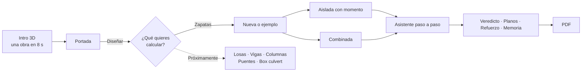
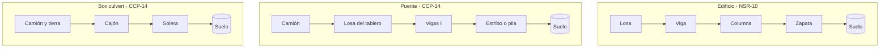
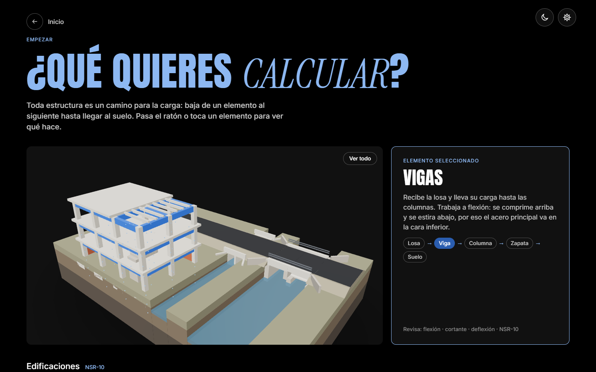
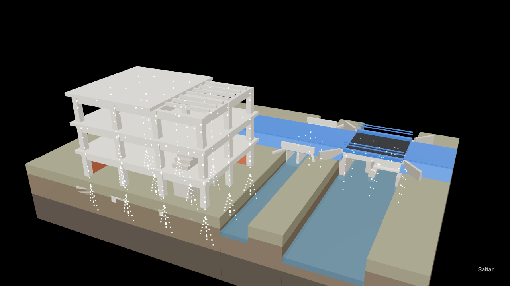
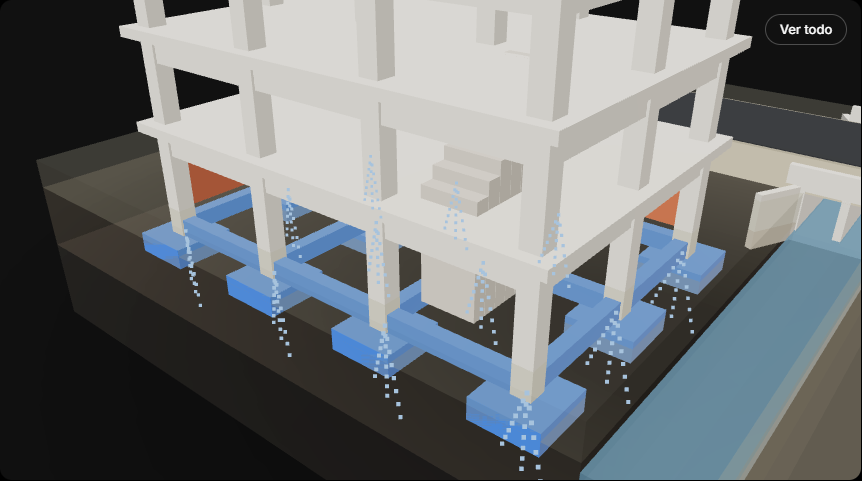
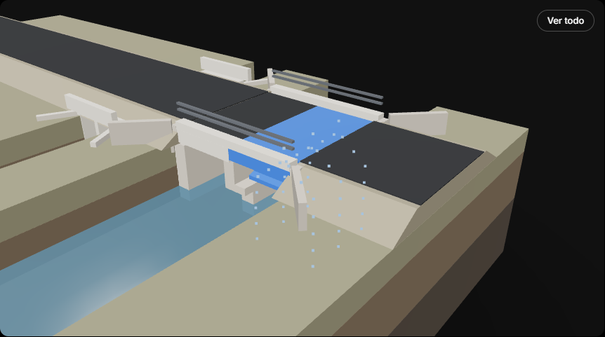
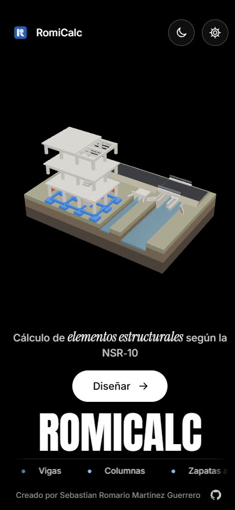

<div align="center">


# RomiCalc

**Cálculo de elementos estructurales según la NSR-10**

Diseña zapatas de concreto reforzado paso a paso, con veredicto inmediato, planos, 3D y memoria de cálculo en PDF.
Aprende cómo viaja la carga en edificios, puentes y box culverts.

[](https://romicalc.netlify.app/)


[Qué hace](#qué-hace) · [Recorrido](#recorrido) · [Galería](#galería) · [Zapatas](#zapatas) · [Hoja de ruta](#hoja-de-ruta) · [Usarla en tu equipo](#usarla-en-tu-equipo) · [Preguntas](#preguntas-frecuentes)


</div>

---

## Qué hace

| | |
|---|---|
| **Enseña** | Una maqueta 3D con un edificio en obra gris, un puente de dos luces y un box culvert. Pasa el ratón por un elemento y verás por dónde baja su carga hasta el suelo. |
| **Calcula** | Zapatas aisladas con momento en dos direcciones y zapatas combinadas de dos columnas, con todos los chequeos de la NSR-10. |
| **Dibuja** | Planta con capas, cortes, diagramas de cortante y momento, y una vista 3D del refuerzo con despiece. |
| **Explica** | Una memoria por diapositivas con ecuaciones en LaTeX y una figura en cada paso, y un PDF listo para entregar. |
| **Recuerda** | Guarda tus proyectos en el navegador. También puedes exportarlos e importarlos en `.json`. |

> Es una aplicación web estática: no necesita servidor, cuenta ni instalación.

## Recorrido



<details>
<summary><b>El camino de las cargas, como lo muestra la maqueta</b></summary>

<br>



En la página **¿Qué quieres calcular?**:
- **Al pasar el ratón** por un elemento, se ilumina en azul y unos puntos bajan por su camino de carga.
- **Al tocarlo**, la cámara viaja hasta él.
- **Con las zapatas o el box culvert**, el terreno se vuelve transparente (rayos X) para verlos enterrados.

</details>

## Galería

<table>
  <tr>
    <td width="50%"><br><sub><b>¿Qué quieres calcular?</b> La maqueta con la viga resaltada y su camino de carga.</sub></td>
    <td width="50%"><br><sub><b>Intro.</b> La obra se construye y la carga baja hasta el suelo.</sub></td>
  </tr>
  <tr>
    <td><br><sub><b>Rayos X.</b> Zapatas y vigas de amarre bajo el edificio.</sub></td>
    <td><br><sub><b>Puente.</b> Luz de vigas I, pila, estribos, neoprenos y barandas.</sub></td>
  </tr>
  <tr>
    <td><br><sub><b>Veredicto.</b> Anillos con el porcentaje de capacidad de cada chequeo.</sub></td>
    <td><br><sub><b>Memoria.</b> Cada paso con su ecuación, su numeral de la NSR-10 y su figura.</sub></td>
  </tr>
  <tr>
    <td><br><sub><b>Refuerzo.</b> Barras o mallas electrosoldadas, en 3D y en planta.</sub></td>
    <td align="center"><br><sub><b>Celular.</b> Funciona en pantallas pequeñas.</sub></td>
  </tr>
</table>

## Zapatas

<details open>
<summary><b>Zapata aislada con momento</b></summary>

<br>

- **Asistente de 7 pasos:** proyecto, cargas, suelo, columna, materiales, planta (con las presiones en vivo) y altura. Tiene botones para proponer L<sub>x</sub>, L<sub>y</sub> y d.
- **Chequeos:**

  | Chequeo | Qué revisa |
  |---|---|
  | Esfuerzos en el suelo | σ<sub>máx</sub> contra el esfuerzo admisible y el núcleo central |
  | Punzonamiento | Cortante en dos direcciones a d/2 de la columna |
  | Cortante en una dirección | A d de la cara de la columna, en X y en Y |
  | Flexión y refuerzo | Barras #2 a #10 o mallas Diaco (NTC 5806), con separación y cuantía |
  | Aplastamiento | Columna sobre la zapata, con A<sub>2</sub> limitada a la zapata |
  | Longitud de desarrollo | Dovelas a compresión dentro de la zapata |

- **Planos:** planta con capas (presiones, punzonamiento, cortante, flexión y refuerzo), cortes X e Y y vista 3D interactiva.

</details>

<details>
<summary><b>Zapata combinada de dos columnas</b></summary>

<br>

- **Asistente de 8 pasos:** proyecto, columnas, cargas, sismo, suelo, materiales y método, ubicación (con columnas que se arrastran) y altura.
- **Chequeos:** presión del suelo con y sin sismo, punzonamiento de cada columna (la exterior con perímetro de tres lados), cortante longitudinal y transversal, flexión, aplastamiento y desarrollo.
- **Planos:** alzado con diagramas de cortante y momento que se leen bajo el cursor, planta con franjas, corte longitudinal, cortes transversales y 3D con capas y despiece animado.
- **Refuerzo por grupos y despiece** con longitudes y pesos.
- **Dos métodos:** *corregido*, por defecto, con presión lineal en equilibrio exacto, y *documento*, que reproduce los números del ejemplo del curso.

</details>

<details>
<summary><b>Unidades, PDF y ajustes</b></summary>

<br>

- **Unidades:** sistema del curso (tonf · m · kgf/cm²), SI (kN · m · MPa, NSR-10 en MPa) e inglés (kip · ft · psi, ACI 318). Los coeficientes de cortante y de anclaje cambian con el sistema.
- **PDF profesional:** portada, contenido, información general, normas y materiales, cargas y combinaciones, suelo y geometría, planos, análisis y diseño, conclusiones y firmas.
- **Ajustes:** tema claro u oscuro, animaciones (activadas, según el sistema o desactivadas) y la opción de saltar la intro.

</details>

## Hoja de ruta

RomiCalc crece por elementos. Cada uno llegará con su asistente, sus chequeos y su memoria.

**Edificaciones (NSR-10)**
- [x] Zapata aislada con momento
- [x] Zapata combinada de dos columnas
- [ ] Vigas
- [ ] Columnas
- [ ] Losas macizas y aligeradas

**Puentes y obras (CCP-14)**
- [ ] Puente de losa
- [ ] Puente de viga y losa
- [ ] Box culvert

## Usarla en tu equipo

La forma más fácil es abrir **[romicalc.netlify.app](https://romicalc.netlify.app/)**. Para usarla sin internet:

1. Descarga o clona el repositorio:

   ```bash
   git clone https://github.com/romisebas/romicalc.git
   ```

2. Abre una terminal en la carpeta y levanta el servidor local. Los navegadores bloquean algunos scripts si se abre `index.html` directamente.

   ```bash
   python herramientas/servidor.py
   ```

3. Abre `http://localhost:8765` en el navegador.

<details>
<summary><b>Correr las pruebas</b></summary>

<br>

Son 60 pruebas automáticas con Playwright para Python:

```bash
pip install pytest playwright
python -m playwright install chromium
python -m pytest tests -q
```

</details>

<details>
<summary><b>Cómo está organizado el código</b></summary>

<br>

```
index.html            página única
css/                  estilos (tokens, componentes, informe)
js/app.js             interfaz: bienvenida, asistente, pestañas, ajustes
js/nucleo/            piezas compartidas: maqueta 3D, intro, unidades, memoria, dibujos, PDF, refuerzo
js/tipos/             motores de cálculo y memoria de cada tipo, catálogo de elementos
js/combinada/         tablero, dibujos, 3D, despiece e informe de la combinada
assets/logo/romicalc/ isotipo, versiones de una tinta e íconos web
vendor/               three.js, KaTeX y fuentes (locales, sin CDN)
tests/                pruebas automáticas
```

- **La maqueta 3D** (`js/nucleo/maqueta3d.js`) es una sola y la usan la intro, la portada y la página de elementos. Está hecha toda en código, sin modelos descargados.
- **Los motores de cálculo** (`js/tipos/`) no tocan la página, así se pueden probar solos.

</details>

## Método y validación

El cálculo sigue el método del curso *Diseño de Concreto II* y la NSR-10.
- **Validación:** el motor de la aislada se compara en cada prueba con 26 valores de su ejemplo, y el de la combinada con 18 valores del suyo.
- **Correcciones en la aislada:** se corrigen tres detalles del documento de referencia: el área de flexión en Y (L<sub>x</sub>·K<sub>y</sub>), la cuantía ρ<sub>y</sub> con R<sub>ny</sub> y el área A<sub>2</sub> limitada a la zapata.
- **Combinada por defecto:** la presión última queda en equilibrio exacto, la cuantía mínima usa b·h y se agregan punzonamiento, aplastamiento y desarrollo.

> [!WARNING]
> Es una herramienta académica. Verifica los resultados antes de usarlos en un proyecto real.

## Preguntas frecuentes

<details>
<summary><b>¿Dónde se guardan mis proyectos?</b></summary>

<br>En tu navegador (almacenamiento local). No se suben a ningún servidor. Para pasarlos a otro equipo, usa <b>Exportar</b> y luego <b>Importar proyecto</b>.
</details>

<details>
<summary><b>¿Perdí mis proyectos al cambiar de ZapatAPP a RomiCalc?</b></summary>

<br>La app guarda los proyectos igual que antes, pero el navegador los separa por dirección. Los que guardaste en la dirección anterior (zapatapp.netlify.app) no aparecen en romicalc.netlify.app. En tu propio equipo, con <code>localhost</code>, siguen ahí. Para no perder trabajo, usa siempre <b>Exportar</b> y guarda el <code>.json</code>.
</details>

<details>
<summary><b>¿Funciona sin internet?</b></summary>

<br>Sí, si la descargas y la abres con el servidor local. Todas las librerías y fuentes vienen incluidas en <code>vendor/</code>.
</details>

<details>
<summary><b>La intro o el 3D van lentos en mi equipo</b></summary>

<br>En <b>Ajustes</b> puedes desactivar las animaciones o saltar la intro. En celulares y equipos lentos la maqueta usa sola una versión más simple, sin sombras.
</details>

## Créditos y licencia

Hecho por **Sebastian Romario Martinez Guerrero** ([@romisebas](https://github.com/romisebas)). Código bajo licencia [MIT](LICENSE).

Componentes de terceros incluidos en `vendor/`: [three.js](https://threejs.org) (MIT), [KaTeX](https://katex.org) (MIT) y las fuentes Inter, Anton e Instrument Serif (SIL Open Font License 1.1).
