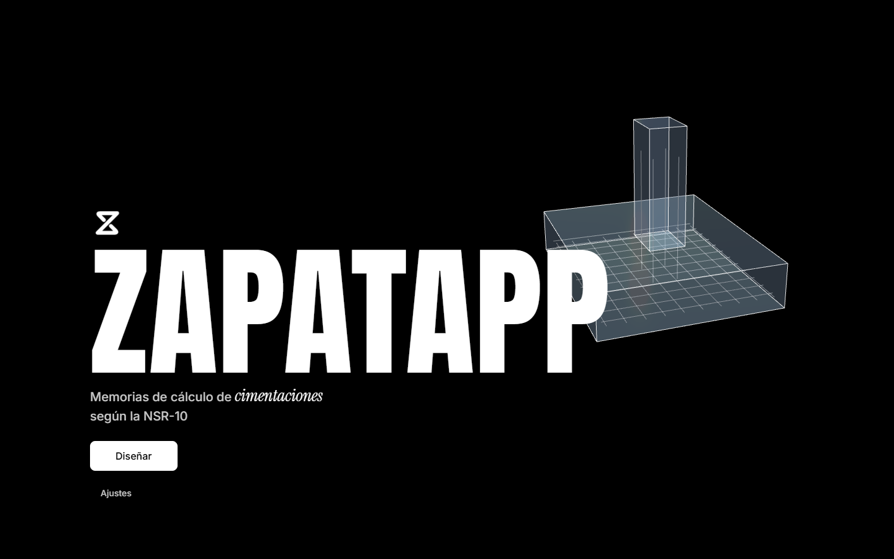
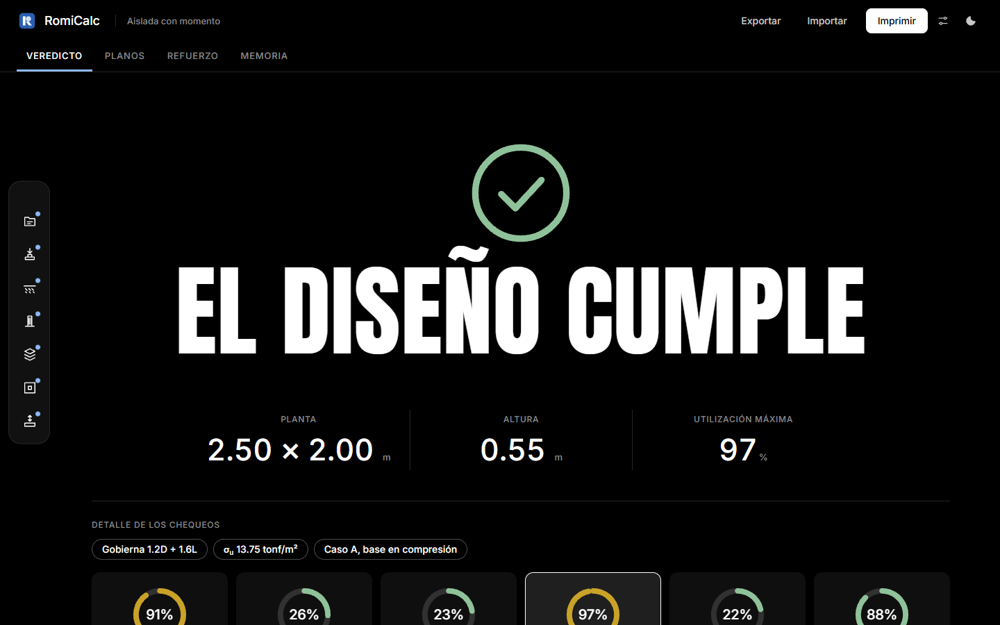
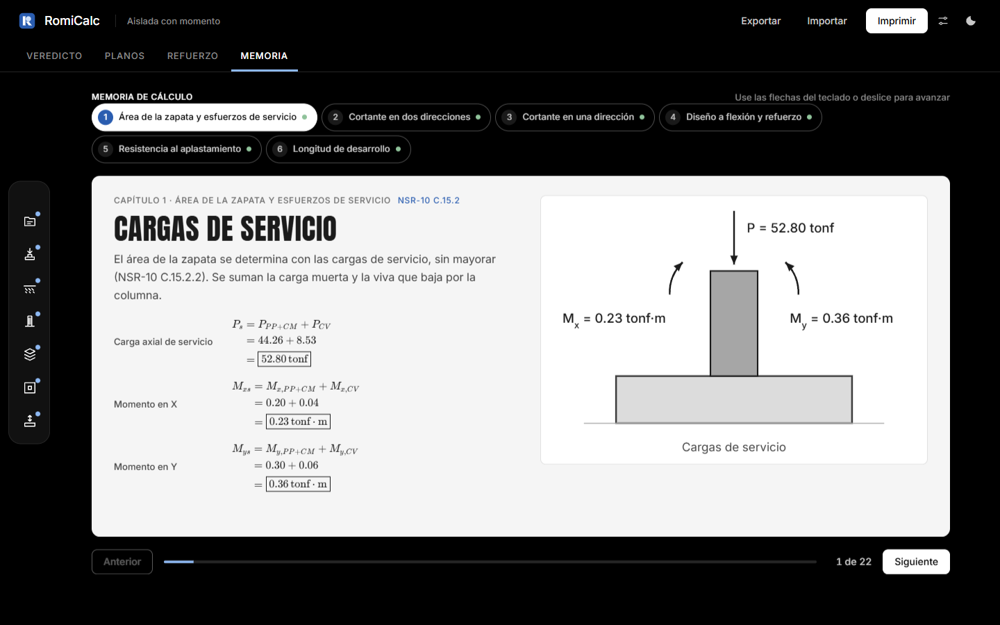
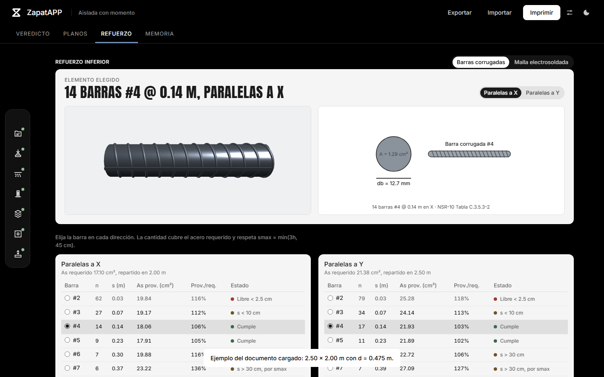

# ZapatAPP

Diseño de zapatas de concreto reforzado según la **NSR-10** (Reglamento Colombiano de Construcción Sismo Resistente, Título C), con memoria de cálculo paso a paso, planos y vista 3D.

**Úsala en línea: [zapatapp.netlify.app](https://zapatapp.netlify.app/)**



ZapatAPP es una aplicación web estática: no necesita servidor ni instalación y guarda los proyectos en el navegador. La versión 1.0 diseña **zapatas aisladas con carga axial y momento en dos direcciones**; los demás tipos (concéntrica, medianera, esquinera, combinada y corrida) llegarán en próximas versiones.

## Qué hace

- **Asistente de 7 pasos**: proyecto, cargas, suelo, columna, materiales, planta (con las presiones en vivo) y altura, con botones para proponer Lx, Ly y d.
- **Veredicto** inmediato con anillos de utilización por chequeo:
  - esfuerzos sobre el suelo y núcleo central;
  - cortante en dos direcciones (punzonamiento) y en una dirección;
  - flexión y refuerzo, con barras #2 a #10 o mallas electrosoldadas Diaco (NTC 5806);
  - aplastamiento y longitud de desarrollo.
- **Planos**: planta con capas (presiones, punzonamiento, cortante, flexión, refuerzo), cortes X e Y y vista 3D interactiva.
- **Memoria de cálculo por diapositivas**: cada paso con texto, ecuaciones en LaTeX (KaTeX) y una figura.
- **Unidades**: sistema del curso (tonf · m · kgf/cm²), SI (kN · m · MPa, NSR-10 en MPa) e inglés (kip · ft · psi, ACI 318). Los coeficientes de cortante y anclaje cambian con el sistema.
- **PDF profesional**: portada, contenido, información general, normas y materiales, cargas y combinaciones, suelo y geometría, planos, análisis y diseño, conclusiones y firmas.
- Exportar e importar proyectos en `.json`, proyectos recientes, tema claro u oscuro y ajuste de animaciones.

| Veredicto | Memoria | Refuerzo |
|---|---|---|
|  |  |  |

## Cómo usarla

La forma más fácil es abrir [zapatapp.netlify.app](https://zapatapp.netlify.app/). Para usarla en tu computador:

1. Descarga o clona el repositorio.
2. Abre una terminal en la carpeta y levanta un servidor local (los navegadores bloquean algunos scripts si se abre `index.html` directamente):

   ```bash
   python -m http.server 8765
   ```

3. Abre `http://localhost:8765` en el navegador.

## Método y validación

El cálculo sigue el método del curso *Diseño de Concreto II* (zapata aislada con momento) y la NSR-10. El motor se valida automáticamente contra 26 valores del ejemplo del curso (tolerancia de 1 %). Se corrigen tres detalles del documento de referencia: el área de flexión en Y (L<sub>x</sub>·K<sub>y</sub>), la cuantía ρ<sub>y</sub> con R<sub>ny</sub> y el área A<sub>2</sub> limitada a la zapata.

> Herramienta académica: verifique los resultados antes de usarlos en un proyecto real.

## Pruebas

Las pruebas usan Playwright para Python:

```bash
pip install pytest playwright
python -m playwright install chromium
python -m pytest tests -q
```

## Estructura

```
index.html            página única
css/                  estilos (tokens, componentes, informe)
js/app.js             interfaz: bienvenida, asistente, pestañas, ajustes
js/nucleo/            módulos compartidos: unidades, memoria, dibujos, 3D, PDF, refuerzo
js/tipos/             motor de cálculo y memoria de cada tipo de zapata
vendor/               three.js, KaTeX y fuentes (locales, sin CDN)
tests/                pruebas automáticas
```

## Créditos y licencia

© 2026 **Sebastian Romario Martinez Guerrero** ([@romisebas](https://github.com/romisebas)). Código bajo licencia [MIT](LICENSE).

Componentes de terceros incluidos en `vendor/`: [three.js](https://threejs.org) (MIT), [KaTeX](https://katex.org) (MIT) y las fuentes Inter, Anton e Instrument Serif (SIL Open Font License 1.1).
